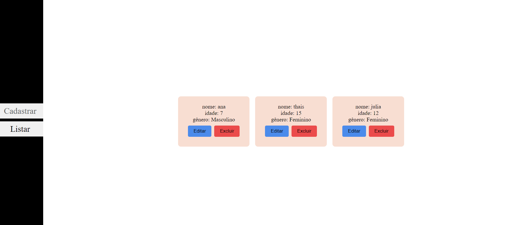

# REST API - CRUD

## Arquitetura
A arquitetura dessa aplicação é exibida na imagem abaixo:

## Teste de rotas
Fiz um front para testar as rotas

### Cadastrar

### Listar

### Editar

### Excluir

